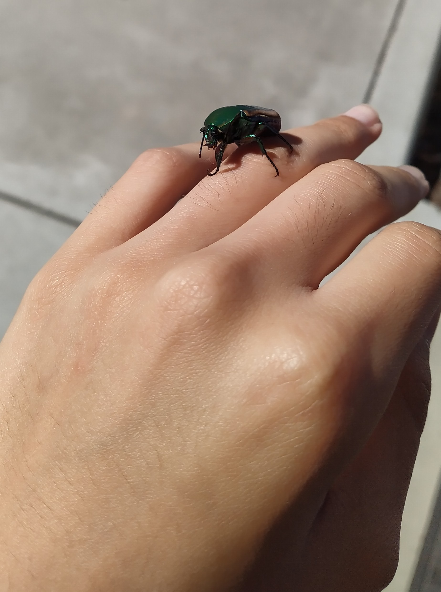

# Lyra's User Page

I'm Lyra, a 20 year old Computer Science Major at UCSD.


> In the beginning the Universe was created. This has made a lot of people very angry and has been widely regarded as a bad move.
> - Douglas Adams, Restaurant at the End of the Universe


## Interests and Hobbies

I've played videogames most of my life, and some of the games I've been most into as of recently are: 
- Guilty Gear Strive
- Final Fantasy XIV *(Currently completing the Heavensward expansion)*
- Dark Souls/DS II/DS III

I've also begun playing Magic the Gathering as of last summer, and have begun learning Go. [(The game, not the programming language)](https://en.wikipedia.org/wiki/Go_(game\))

I'm an officer for an on-campus art club, but am unable to draw or paint, funnily enough.

Here is an image of me wearing a cool beetle on my ring finger!


## Programming and Classwork
This quarter, I am taking a course on software development for which this page is a project for! (You can read less about it at this [nearly empty README page](README.md))

I am also taking:
1. **CSE 152A**, an intro course to Computer Vision
2. **PHIL 1**, an intro to Philosophy course
    - I have taken previous philosophy courses before, and had a great time in particular with **PHIL 13**, but need to take this to fulfill the Muir requirement for the ones I took.
3. **COGS 101B**, a course on Learning, Memory and Attention
   - It strikes me that if this course gives me practical knowledge, it could help me going forward (and likely would have helped me in past quarters as well.)


Some programming languages I've "touched" (used, not necessarily mastered)
```
Python
C
C++
Haskell
Java
```

## Misc
Things I have to do this weekend:
- [x] Laundry
- [x] This assignment
- [ ] Clean the kitchen